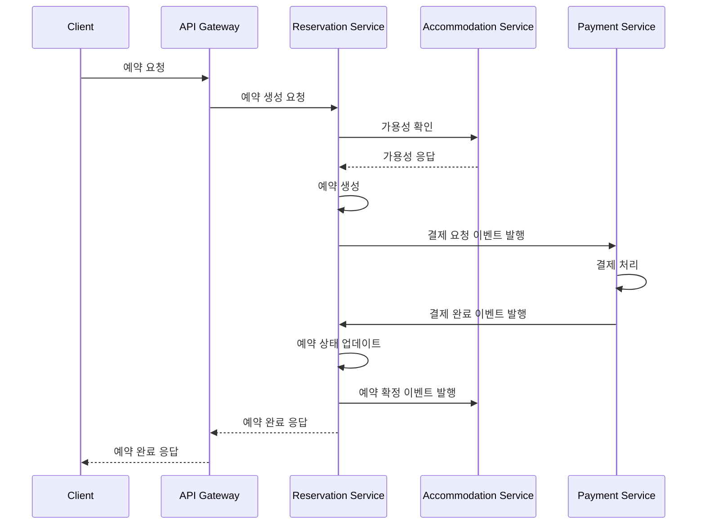
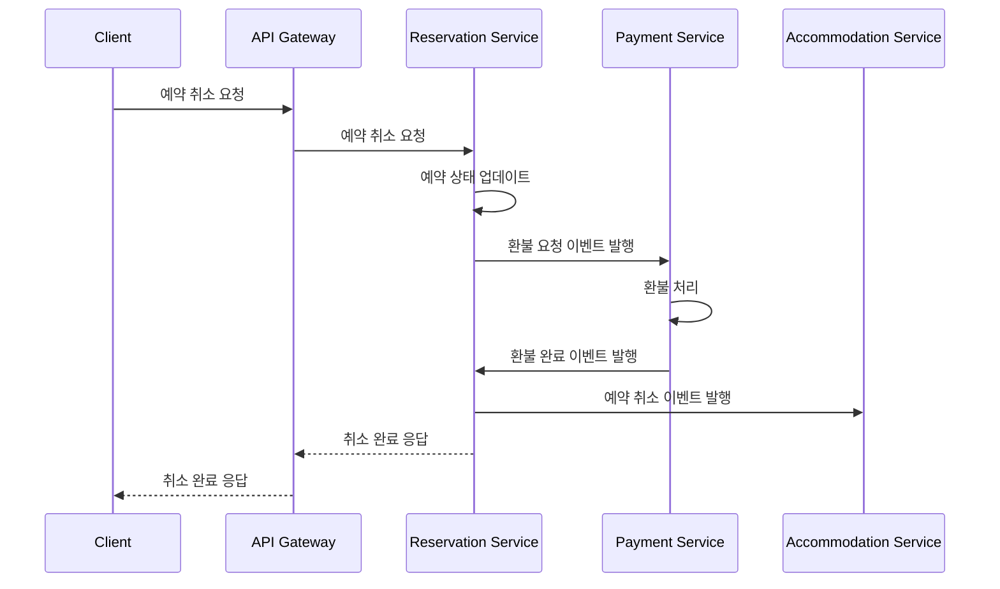
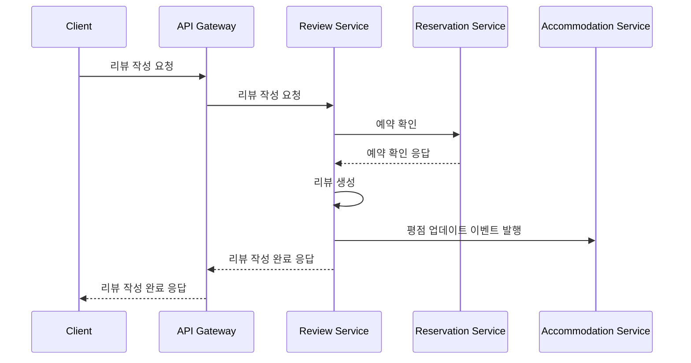

# TripHub 이벤트 흐름 정의

## 1. 예약 프로세스 이벤트 흐름

### 1.1 예약 생성 흐름

### 1.2 예약 취소 흐름

## 2. 리뷰 프로세스 이벤트 흐름

### 2.1 리뷰 작성 흐름

## 3. 이벤트 정의

### 3.1 예약 도메인 이벤트
- `ReservationCreatedEvent`
  - 발행: 예약 서비스
  - 구독: 결제 서비스
  - 데이터: 예약 ID, 금액, 결제 정보

- `ReservationConfirmedEvent`
  - 발행: 예약 서비스
  - 구독: 숙박 서비스
  - 데이터: 예약 ID, 숙소 ID, 객실 ID, 날짜

- `ReservationCancelledEvent`
  - 발행: 예약 서비스
  - 구독: 결제 서비스, 숙박 서비스
  - 데이터: 예약 ID, 취소 사유

### 3.2 결제 도메인 이벤트
- `PaymentCompletedEvent`
  - 발행: 결제 서비스
  - 구독: 예약 서비스
  - 데이터: 결제 ID, 예약 ID, 금액

- `PaymentFailedEvent`
  - 발행: 결제 서비스
  - 구독: 예약 서비스
  - 데이터: 결제 ID, 예약 ID, 실패 사유

- `RefundCompletedEvent`
  - 발행: 결제 서비스
  - 구독: 예약 서비스
  - 데이터: 결제 ID, 예약 ID, 환불 금액

### 3.3 리뷰 도메인 이벤트
- `ReviewCreatedEvent`
  - 발행: 리뷰 서비스
  - 구독: 숙박 서비스
  - 데이터: 리뷰 ID, 숙소 ID, 평점

- `ReviewUpdatedEvent`
  - 발행: 리뷰 서비스
  - 구독: 숙박 서비스
  - 데이터: 리뷰 ID, 숙소 ID, 평점

- `ReviewDeletedEvent`
  - 발행: 리뷰 서비스
  - 구독: 숙박 서비스
  - 데이터: 리뷰 ID, 숙소 ID

## 4. 이벤트 저장소

### 4.1 이벤트 저장 전략
- Apache Kafka를 이벤트 저장소로 사용
- 각 이벤트는 JSON 형식으로 직렬화
- 이벤트 스키마는 Avro로 정의

### 4.2 이벤트 보존 정책
- 이벤트는 30일간 보존
- 중요한 이벤트는 장기 보존을 위해 별도 저장소에 백업

### 4.3 이벤트 재처리
- 실패한 이벤트는 재시도 큐에 저장
- 최대 3회까지 재시도
- 재시도 실패 시 알림 발송 